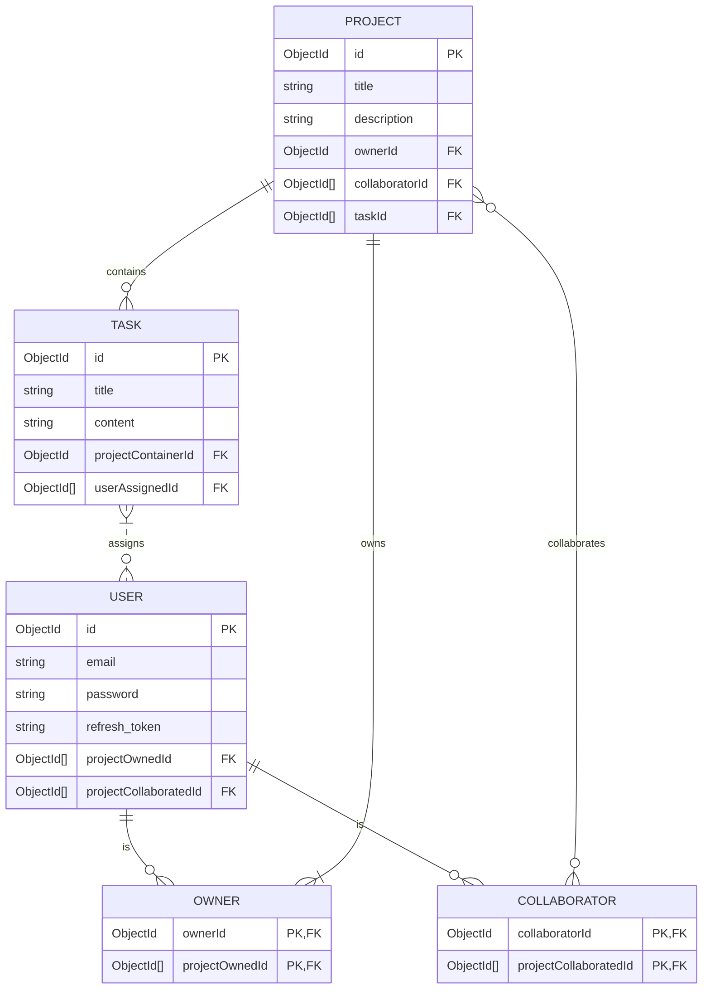

# Bourne Task App API

#### (Work in progress)
#### This backend provides the API endpoints for the Bourne Task App.

### Table of Contents

- [Installation](#installation)
  - [Nix Dev Environment](#nix-dev-environment)
- [Development](#development)
  - [MongoDB instance during development](#mongodb-instance-during-development)
- [Testing](#testing)
  - [Unit Tests](#unit-tests)
  - [End-to-end Tests](#end-to-end-tests)
- [Production](#production)
- [Schema](#schema)
- [Contribute](#contribute)
- [License](#license)

## Installation <a name="installation"></a>

```bash
$ yarn install
```

<details>
<summary>Nix Dev Environment </summary>

### Nix Dev Environment <a name="nix-dev-environment"></a>

- The development environment on my local machine is set up using a declarative approach with the help of a `flake.nix` file. It provides an isolated environment that includes the necessary packages like `nest-cli` and `docker`.

  - If you use Nix and enabled flake experimental features: you can just run:

```bash
# This will install packages such as nodejs, yarn, etc and run `yarn install`
$ nix develop
```

- You can also enable `direnv` in order to [automatically enter the environment](https://devenv.sh/automatic-shell-activation/#using-direnv) without running `nix develop` all the time

- If you want this type of workflow, checkout [devenv.sh](https://devenv.sh/getting-started/)

      - In this context, the presence of `devenv.nix` is not required as the configuration expression is already declared as a module within the `flake.nix` file.

  </details>

## Development <a name="development"></a>

- Prerequisite: `docker`

```bash
# development
$ yarn run start

# watch mode
$ yarn run start:dev
```
### MongoDB instance during development <a name="mongodb-instance-during-development"></a>

- A MongoDB docker container will be instantiated when you run `yarn start`.
- Then you can use Insomnia/Postman to make your HTTP requests and check the database with Mongo Shell or MongoDB Compass.

## Testing <a name="testing"></a>

```bash
# unit tests
$ yarn run test

# test coverage
$ yarn run test:cov
```

### Unit Tests <a name="unit-tests"></a>

- The tests uses `mongodb-memory-server` which spins up a `mongod` instance and holds data in memory.

- In the rare case that your operating system does not have a [prebuilt binary for mongodb](https://nodkz.github.io/mongodb-memory-server/docs/guides/supported-systems/) such as Alpine Linux or NixOS (the machine that I use 💪)

  - You can run a Docker container with a Debian image.

```bash
# Build the 'test-watch' service. See docker-compose.yml
$ docker compose build test-watch

# Run the container. This will be equivalent to 'jest --watch'
$ docker compose run test-watch
```

### End-to-end Tests <a name="end-to-end-tests"></a>

- Prerequisite: `docker`
- We have to use an actual MongoDB instance for end-to-end testing for this one but we have to isolate it from our MongoDB playground.
- The file `.env.test` contains the connection string to our test database, which is declared as a service in the `docker-compose.yml`, named: `test-e2e-db`.
    - The port used is `27018` instead of `27017` that is used by our MongoDB playground instance in order to not have any conflicts.

```bash
# This will automatically run all the docker setup if no e2e test instance of mongodb is running
$ yarn test:e2e
```

## Production <a name="production"></a>

```bash
# production mode
$ yarn run start:prod
```

<details>
<summary>Schema</summary>

## Schema <a name="schema"></a> 

- This ER diagram represents the relationships between the object models in the context of a collaborative task application. 
- The diagram showcases the relationships between entities using standard ER notation, but it's important to note that the actual implementation is based on a document-based model (such as MongoDB) rather than a traditional relational database.



- How to read:
    - Key entities include PROJECT, USER, and TASK, each having their own set of attributes and relationships.
    - The PROJECT entity has a one-to-many relationship with TASK, indicating that a project can contain zero to many tasks.
    - The PROJECT entity has exactly one owner and zero to many collaborators.
    - The USER entity is connected to both OWNER and COLLABORATOR entities, representing the ownership and collaboration relationships with projects. OWNER and COLLABORATOR are relationship entities/tables and do not exist as a separate document in the database. However, they exist in the diagram as demonstration to the relationships between USER and PROJECT.
    - TASK is associated with USER through a many-to-many relationship, indicating that tasks can be assigned to zero to many project members (owner and collaborators).
    - The diagram highlights the ownership aspect by showing that an OWNER can own multiple projects.
    - Additionally, the diagram reflects the collaboration aspect by demonstrating that a COLLABORATOR can collaborate on multiple projects.
    - The relationships between entities are established through references using ObjectIds, facilitating the linkage between related documents in the document-based model.

</details>

## Contribute <a name="contribute"></a>

Feel free to open an issue/PR if you have a question, suggestion, whatever.

## License <a name="license"></a>

The project is licensed under the MIT license.
